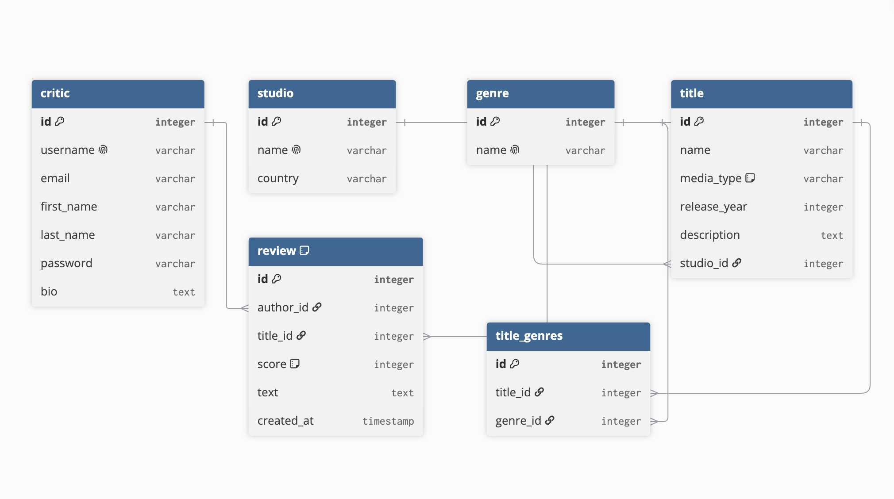
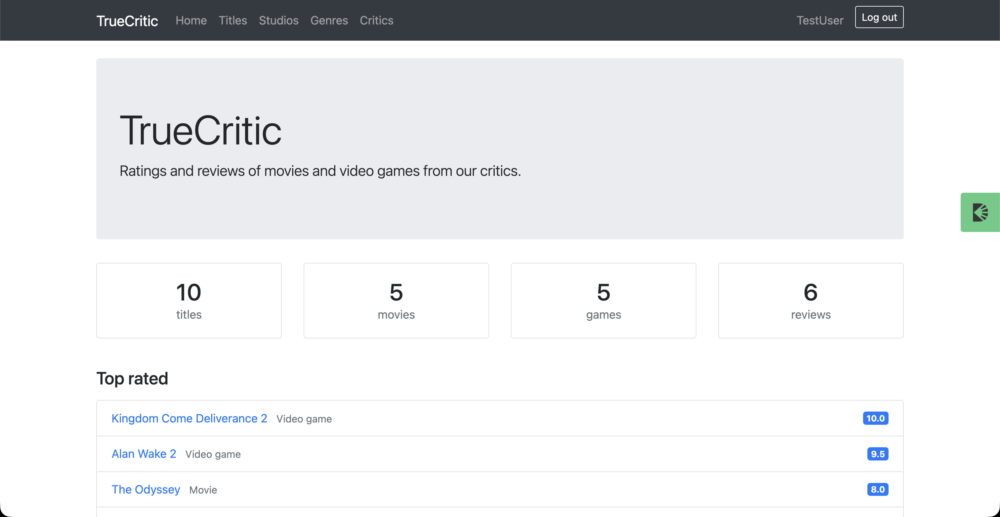
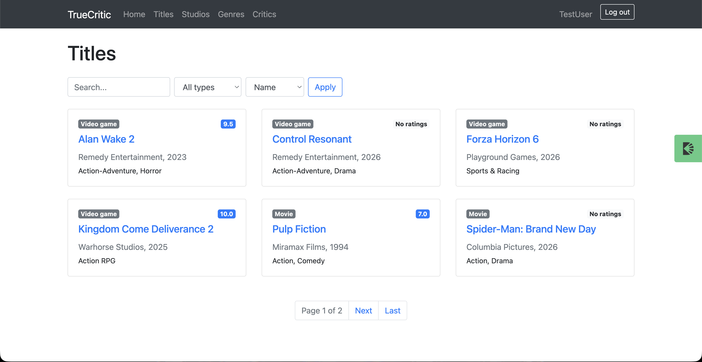
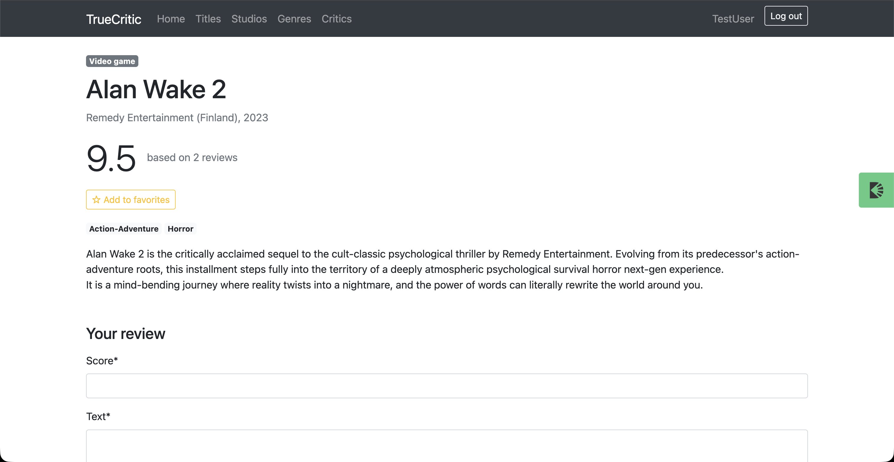

# TrueCritic

A Django web application for rating and reviewing movies and video games, inspired by Metacritic. Critics write reviews with a score from 1 to 10, and every title gets an average rating calculated from all its reviews.

## Features

- **Public catalog** — titles, studios, genres and critics are available without logging in
- **Reviews** — logged-in users can write one review per title and edit or delete only their own reviews
- **Average rating** — calculated in the database for every title and shown on the title page and in the catalog
- **Filtering and sorting** — search by name, filter movies or games, sort by name, rating or release year
- **Top rated** — the five best titles on the home page
- **Favorites** — users can add titles to favorites and see them in their profile
- **Staff-only catalog management** — only staff users can create, edit and delete titles, studios and genres
- **Authentication** — sign up (with automatic login), log in, log out
- **Search and pagination** on all list pages, keeping search and filter parameters between pages
- **Tests** for models, forms, access rules, reviews, rating, filtering and favorites

## Tech stack

- Python 3.12, Django
- SQLite
- Bootstrap 4, django-crispy-forms
- django-debug-toolbar (development)

## Database structure



Main models:

- **Critic** — custom user model (extends `AbstractUser`) with an optional bio
- **Studio** — a company that produced a title
- **Genre** — a title can have several genres (many-to-many)
- **Title** — a movie or a video game, linked to a studio and genres
- **Review** — a critic's score (1–10) and text for a title, one review per critic and title

## Installation

```bash
git clone https://github.com/AndrewBudkin1/TrueCritic.git
cd TrueCritic

python3 -m venv venv
source venv/bin/activate  # on Windows: venv\Scripts\activate

pip install -r requirements.txt

python manage.py migrate
python manage.py loaddata catalog_data.json
python manage.py runserver
```

Then open http://127.0.0.1:8000/.

## Test users

The fixture contains test data and these users:

| Role | Username | Password |
|------|----------|----------|
| Staff | admin | 12345 |
| Critic | TestUser | y0!(0B3M!11VVcp |

You can also create your own superuser:

```bash
python manage.py createsuperuser
```

## Running tests

```bash
python manage.py test
```

## Screenshots





## Future improvements

- Email confirmation on sign up
- Password reset by email
- Title posters
- Color-coded scores
